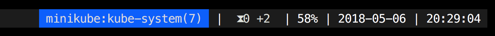

# The TMUX Kubernetes status plugin

**_Note: Hi! This plugin is not actively maintained at the moment, please check this repository out if you're looking for a similar project: https://github.com/jonmosco/kube-tmux /Mikael_**

This `tmux` plugin displays your `kubectl` context status information in the status bar. 

Example:



From the official Kubernetes documentation:

_A context element in a kubeconfig file is used to group access parameters under a convenient name. Each context has three parameters: **cluster**, **namespace**, and **user**. By default, the kubectl command-line tool uses parameters from the current context to communicate with the cluster._

## Usage
Add `#{k8s_status}` to your `status-left` or `status-right`:

Example:
```
set -g status-right '#{k8s_status} %a %Y-%m-%d %H:%M'
```

The information in the status bar will be presented in the following way:

```<context>:<cluster>:<namespace>(<number of pods>)```

## Installation via Tmux Plugin Manager

1. Install [Tmux Plugin Manager][tpm].
2. Add this plugin to your `~/.tmux.conf`:
```
set -g @plugin 'mikejoh/tmux-k8s'
```
3. Press [prefix] + `I` to install.

## Manual installation

1. Create the tmux plugin directory and clone this repository:
```
mkdir -p ~/.tmux/plugins && git clone https://github.com/mikejoh/tmux-k8s.git ~/.tmux/plugins/tmux-k8s
```
2. Press [prefix] + `I` to install.

### Bonus

If you want to use my status bar setup in tmux, or basically use my tmux.conf as is, you can find more info [here][tmux_gist].

[tmux_gist]: https://gist.github.com/mikejoh/d2021745632f404ab8a47a3667168398
[tpm]: https://github.com/tmux-plugins/tpm
